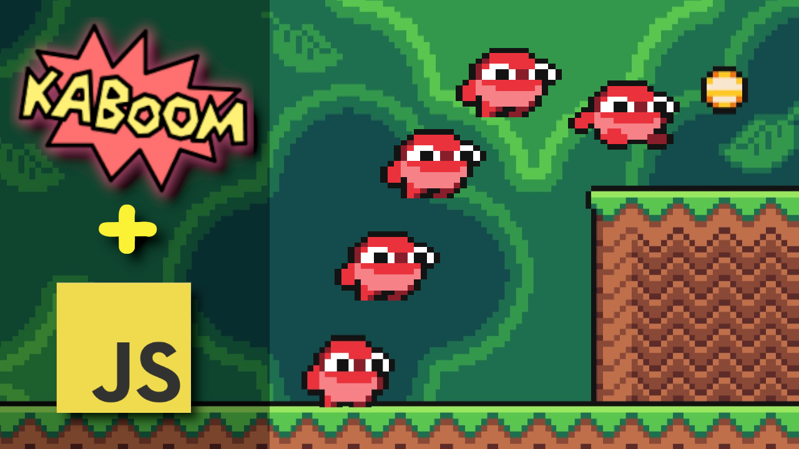
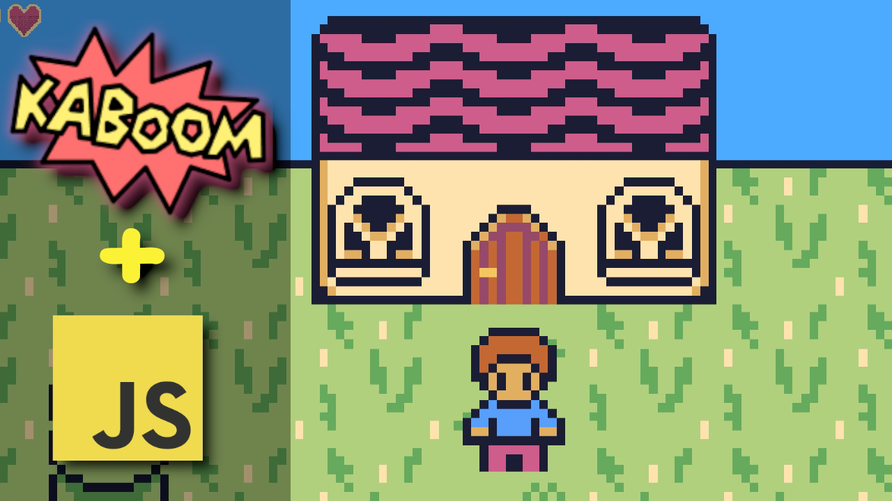
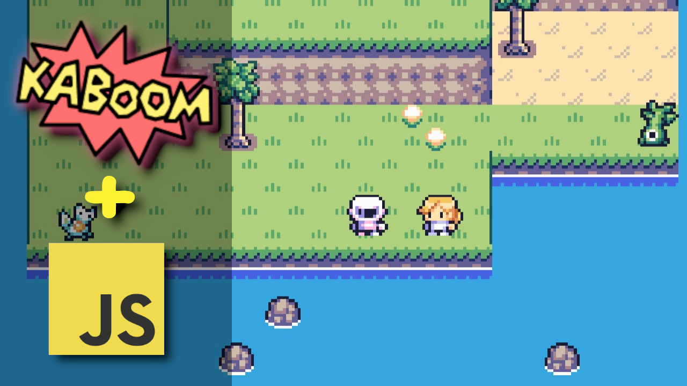
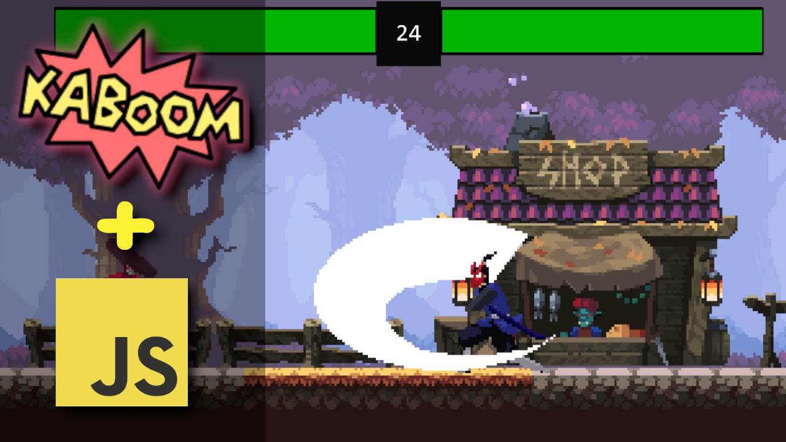
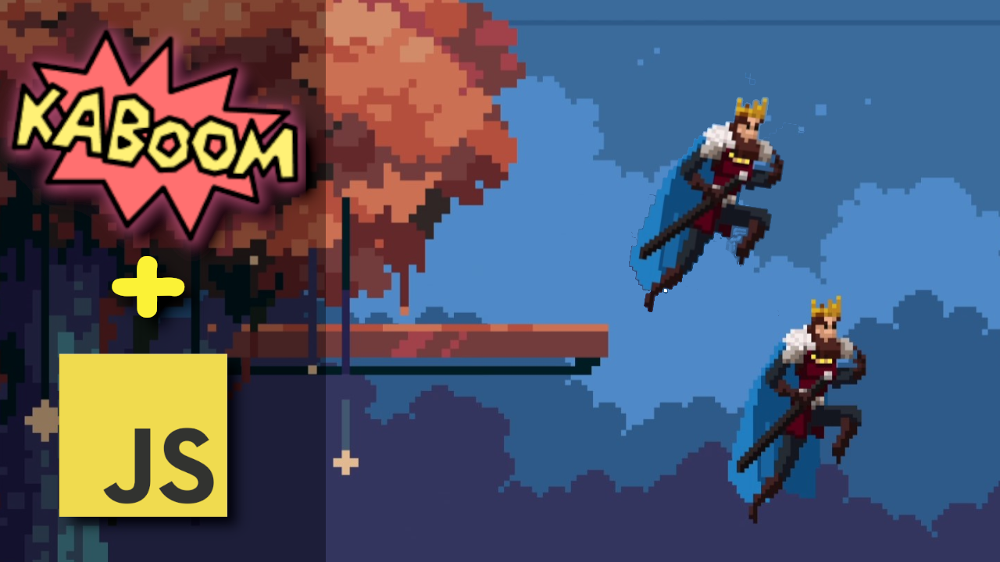
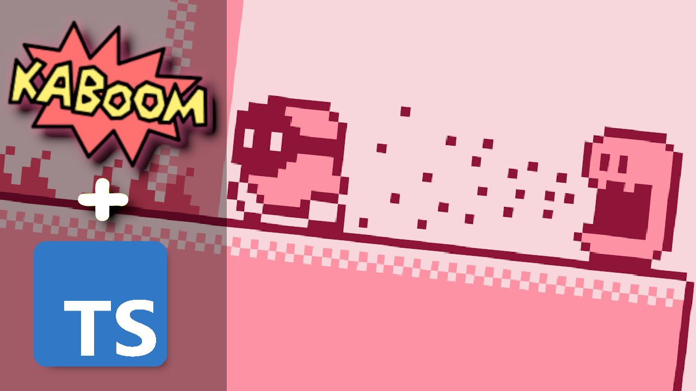
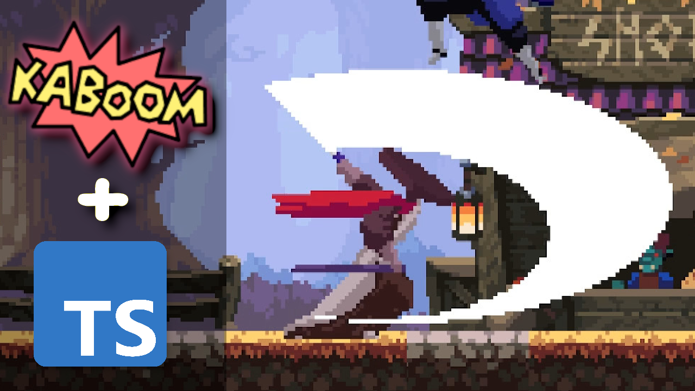
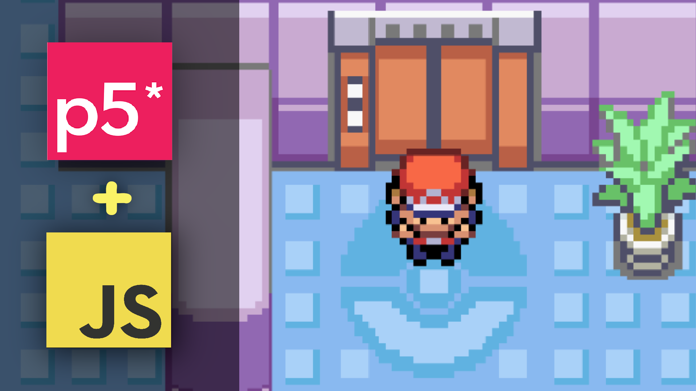

# JavaScript GameDev Tutorials List

A list of JavaScript (some in TypeScript) Game Development tutorials made by me.

## Kaboom.js

Kaboom is an open source library for making games quickly. It's very easy to use.

#### JavaScript Platformer Tutorial

- [YouTube tutorial](https://www.youtube.com/watch?v=wZpbTR7pYR0)
- [source code](https://github.com/JSLegendDev/Mario-Game-Kaboom.js)
- [live demo](https://jslegenddev.github.io/Mario-Game-Kaboom.js/)

#### JavaScript Zelda-like Game Tutorial

- [YouTube tutorial](https://www.youtube.com/watch?v=pVAmEJqK-3A)
- [source code](https://github.com/JSLegendDev/Zelda-like-Kaboomjs)
- [live demo](https://jslegenddev.github.io/Zelda-like-Kaboomjs/)

#### JavaScript Pokemon Game Tutorial

- [YouTube tutorial](https://www.youtube.com/watch?v=zo3crHnFGho)
- [source code](https://github.com/JSLegendDev/Pokemon-like-Game-Made-in-Kaboom.js)
- [live demo](https://jslegend.itch.io/pokemon-like-tutorial-kaboomjs)

#### JavaScript Fighting Game Tutorial

- [YouTube tutorial](https://www.youtube.com/watch?v=TLH0taCeE6I)
- [source code](https://github.com/JSLegendDev/Fighting-Game-Kaboomjs)
- [live demo](https://jslegend.itch.io/fighting-game-tutorial-kaboomjs)

#### JavaScript Vertical Platformer Tutorial

- [YouTube tutorial](https://www.youtube.com/watch?v=Dkxwe_Gv7q4)
- [source code](https://jslegend.itch.io/vertical-platformer-kaboomjs)
- [live demo](https://github.com/JSLegendDev/Vertical-Platformer-Kaboomjs)

#### TypeScript Kirby-like Platformer Game Tutorial

- [YouTube tutorial](https://www.youtube.com/watch?v=rICeqnbzkZk)
- [source code](https://github.com/JSLegendDev/Kirby-like-ts)
- [live demo](https://jslegend.itch.io/kirby-like-platformer-asset-pack)

#### TypeScript Fighting Game Tutorial

- [YouTube tutorial](https://www.youtube.com/watch?v=P0y1k8OYo4g)
- [source code](https://github.com/JSLegendDev/Fighting-Game-TypeScript)
- [live demo](https://jslegend.itch.io/fighting-game-in-typescript)

## p5.js

A great library for creative coding. Can be used to make games but you need to implement collision detection, a camera system, animations, etc. all by yourself.

#### JavaScript Pokemon Game Tutorial with p5.js

- [YouTube tutorial](https://www.youtube.com/watch?v=WPT2BmkFFyo)
- [source code](https://github.com/JSLegendDev/Pokemon-p5js)
- [live demo](https://jslegend.itch.io/p5-pokemon-prototype)

Subscribe to my YouTube channel to be notified when I upload new tutorials.

[view channel here](https://www.youtube.com/@jslegenddev)
